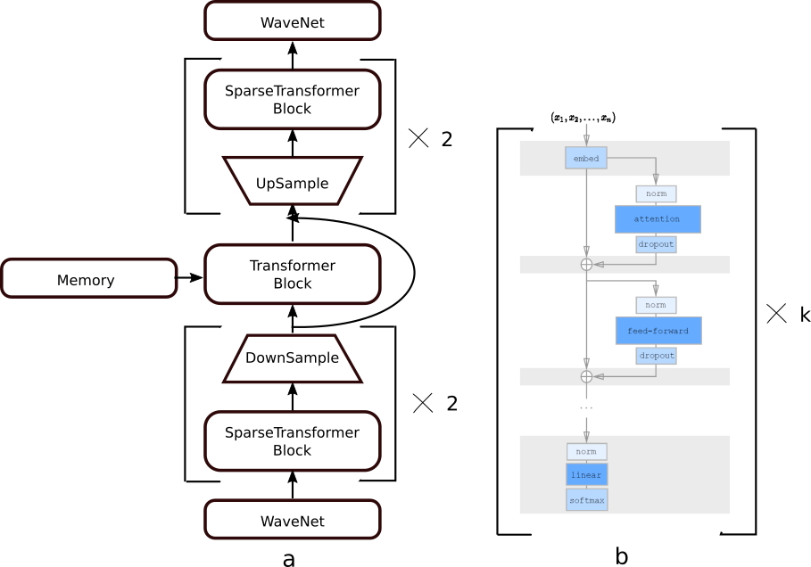

# SampleTransformer: Modeling high fidelity music in raw audio domain
In this project, we attempt to scale sparse transformer architecture for long-range dependencies. we construct a network including 40 layers of transformer layers plus two wavenet models.  Our network is trained on 2 seconds of music, however, with the help of non-trainable memory, the context for predicting the next sample is extended to 8 seconds.   

## Dependencies

* tensorflow == 1.13
* Librosa
* tqdm
* blocksparse

## Dataset

The music dataset introduced in paper [SampleRNN](https://arxiv.org/abs/1612.07837).

## Overview

Our network consists of two wavenets (at the beginning and the ), sparse transformer blocks and a transformer block in the middle. Similar to U-Net architecture, there are down\up sampling modules following each sparse transformer block,  connecting symmetrically. Inspired by [transformer XL](https://arxiv.org/abs/1901.02860), the transformer block in the middle attends to detached memory to increase sample context. Architecture of the network is shown in Fig.1.

*Fig.1 architecture of the network. (a) Overall architecture (b) inside transformer blocks (sparse or normal)*

## Usage:

Install forked [blocksparse](https://github.com/hamedhaghighi/blocksparse) by compiling the source code. 

For training, use command below:

python main.py
    
Generation WIP ...
